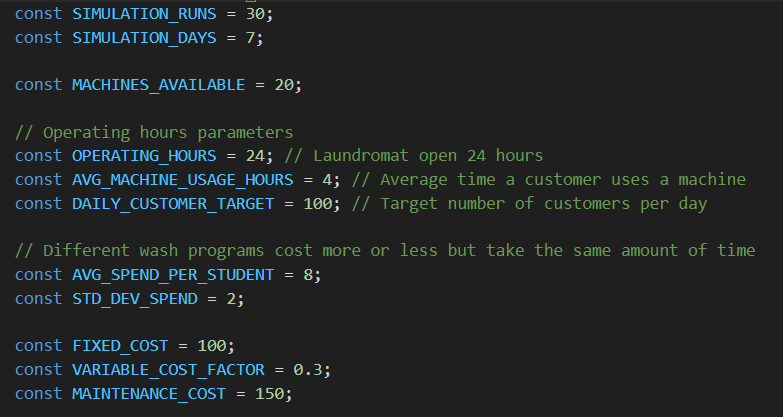
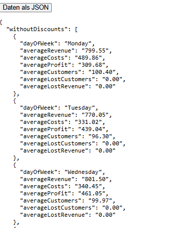

# [Beleg 1] Monte Carlo Simulation einer Wascherei
_Ersteller: Ivan Rusev 201222009_ 

_Datum: 12.03.25_
## Einheit
- [Aufgabenstellung](#aufgabe)
- [Simulation](#simulation)
    - [Parameter](#parameter)
- [Ergebnisse](#ergebnisse)
    - [Charts](#ergebnisse-charts)
    - [Json](#ergebnisse-json)
- [Code](/src/simulation/sim.js)

## 
Aufgabenstellung
  
    Ziel der Simulation ist es, den Betrieb einer Wascherei mit Monte Carlo
    Methoden zu modellieren. Dabei werden verschiedene Parameter wie die Anzahl
    der Maschinen, die Anzahl der Kunden und die Kosten berechnet,
    um die Wirtschaftlichkeit der Wascherei zu optimieren.

**Scenario**: 
    Ein Freund, der eine Wascherei im Studentenstadt hat, mochtet sein Business optimieren. Er hat 20 kombinierte Wasch/Trockenmaschine und insgesamt 100 Kunden pro tag(+- 20). Sein grosstes Problem ist, dass am Wochenend zu viele Kunden reinkommen(bis zu 40%), und er kann nicht alles schaffen und verliert seine Kliente => weniger Profit. Wir mochten diese Kunden wahrend der Woche bedienen, deshalb schlagen wir folgendes vor:
    Ein Rabatt am Wochentage 10%, und 20% am Freitag, dann kommen weniger Kunden am Wochenende(20%) und mehr wahrend die Wochentagen(10%). Der Waschereichef mochtet ein Vergleich zwischen seinen jetzigen Model und unser.

## 
Simulation
  
    Die Monte Carlo Simulation basiert auf zufälligen Variationen, 
    die für jeden Tag einer Woche durchgeführt werden. Hierbei werden 
    Parameter wie die Anzahl der Kunden, die Nutzung der Maschinen und die Kosten
    für den Betrieb der Wascherei berücksichtigt.

_**DIE ZWEI SCENARIEN LAUFEN GLEICHZEITIG:**_
- Kein Rabatt
- Rabatt fur Wochentage 10% und 20% fur Freitag, um kleiner Kundenumsatz am Wochenend zu haben

### 
Parameter
  
Die Simulation nutzt folgende Parameter:
- **Maschinenanzahl**: Anzahl der verfügbaren Waschmaschinen.
- **Kundenzahl**: Zufällig generierte Kundenzahl basierend auf einer Normalverteilung.
- **Durchschnittlicher Umsatz pro Kunde**: Berechnet auf Basis zufälliger Ausgaben jedes Kunden.
- **Kosten**: Fixkosten für den Betrieb sowie variable Kosten basierend auf dem Umsatz.
- **Wochentag**: Für das Wochenende gelten erhöhte Kosten und mehr Kunden.

## 
Ergebnisse
  
    Die Ergebnisse der Simulation zeigen den durchschnittlichen Umsatz, die Kosten 
    und den Gewinn für jeden Tag der Woche. Es wird auch aufgezeigt, wie viele 
    Kunden aufgrund von Kapazitätsbeschränkungen abgewiesen wurden und wie 
    dies den Umsatz beeinflusst hat.

### 
Charts
  

Die Website ist [hier.](https://mc-wascherei-node.onrender.com/)

### 
JSON
  

### Vorschläge basierend auf den Ergebnissen:

1. **Woche optimieren**: 
    An Wochenenden gab es eine hohe Anzahl an abgewiesenen Kunden. 
    Es könnte sinnvoll sein, die Maschinenkapazität oder die Anzahl der 
    verfügbaren Mitarbeiter zu erhöhen, um den Umsatz zu steigern.
2. **Kostenreduktion**: 
    Die Kosten an Werktagen sind tendenziell niedriger. Eine Optimierung 
    der Betriebskosten während der Woche könnte den Gewinn weiter verbessern.
3. **Preis erhohen**: 
    Eine mögliche Preisstrategie wäre es, während der Woche Rabatte 
    anzubieten, um die Auslastung zu steigern und den Umsatz zu erhöhen.
4. **Kunden behalten**: 
    Jede Wochenende verliert die Wascherei mindestens 10-20 Kunden, und deshalb sinkt die Profit in der Zukunft. Mit dem neuen Model passiert dieselbe Verlust im 10 Wochen, die ist genug Zeit neue Kunden zu bekommen.