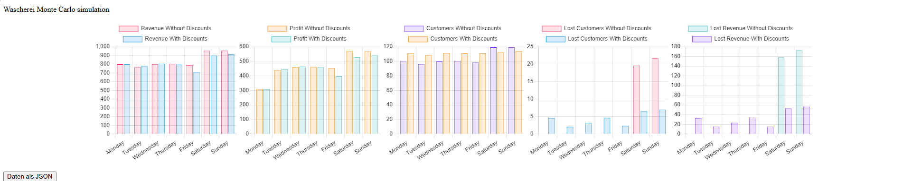

# [Beleg 1] Monte Carlo Simulation einer Wascherei

_Ersteller: Ivan Rusev 201222009_  
_Datum: 12.03.25_

## Gliederung
- [Aufgabenstellung](#aufgabe)
- [Simulation](#simulation)
    - [Parameter](#parameter)
- [Ergebnisse](#ergebnisse)
    - [Diagramme](#ergebnisse-charts)
    - [Json](#ergebnisse-json)
- [Code](/src/simulation/sim.js)

## 
Aufgabenstellung

Ziel der Simulation ist es, den Betrieb einer Wascherei mit Monte Carlo Methoden zu modellieren. Dabei werden verschiedene Parameter wie die Anzahl der Maschinen, die Anzahl der Kunden und die Kosten berechnet, um die Wirtschaftlichkeit der Wascherei zu optimieren.

**Szenario**:

Ein Freund, der eine Wascherei im Studentenwohnheim betreibt, möchte sein Geschäft optimieren. Er verfügt über 20 kombinierte Wasch-/Trockenmaschinen und bedient insgesamt etwa 100 Kunden pro Tag (±20). Sein größtes Problem besteht darin, dass am Wochenende zu viele Kunden kommen (bis zu 40%), sodass er nicht alle bedienen kann und dadurch Kunden verliert, was zu weniger Gewinn führt. 

Wir möchten diese Kunden auf die Wochentage umverteilen und schlagen daher folgendes vor: Ein Rabatt von 10% an Wochentagen und 20% am Freitag. Dadurch sollen weniger Kunden am Wochenende (20%) und mehr während der Wochentage (10%) kommen. Der Wäschereibesitzer möchte einen Vergleich zwischen seinem jetzigen Modell und unserem Vorschlag.

## 
Simulation

Die Monte Carlo Simulation basiert auf zufälligen Variationen, die für jeden Tag einer Woche durchgeführt werden. Hierbei werden Parameter wie die Anzahl der Kunden, die Nutzung der Maschinen und die Kosten für den Betrieb der Wascherei berücksichtigt.

**DIE ZWEI SZENARIEN LAUFEN GLEICHZEITIG:**
- Kein Rabatt
- Rabatt für Wochentage (10%) und für Freitag (20%), um die Kundenanzahl am Wochenende zu reduzieren

### 
Parameter

Die Simulation nutzt folgende Parameter:
- **Maschinenanzahl**: Anzahl der verfügbaren Waschmaschinen.
- **Kundenzahl**: Zufällig generierte Kundenzahl basierend auf einer Normalverteilung.
- **Durchschnittlicher Umsatz pro Kunde**: Berechnet auf Basis zufälliger Ausgaben jedes Kunden.
- **Kosten**: Fixkosten für den Betrieb sowie variable Kosten basierend auf dem Umsatz.
- **Wochentag**: Für das Wochenende gelten erhöhte Kosten und mehr Kunden.

## 
Ergebnisse

Die Ergebnisse der Simulation zeigen den durchschnittlichen Umsatz, die Kosten und den Gewinn für jeden Tag der Woche. Es wird auch aufgezeigt, wie viele Kunden aufgrund von Kapazitätsbeschränkungen abgewiesen wurden und wie dies den Umsatz beeinflusst hat.

### 
Diagramme

Die Website ist [hier](https://mc-wascherei-node.onrender.com/) verfügbar.

### 
JSON

### Vorschläge basierend auf den Ergebnissen:

1. **Wochenoptimierung**:  
   An Wochenenden gab es eine hohe Anzahl an abgewiesenen Kunden. Es könnte sinnvoll sein, die Maschinenkapazität oder die Anzahl der verfügbaren Mitarbeiter zu erhöhen, um den Umsatz zu steigern.

2. **Kostenreduktion**:  
   Die Kosten an Werktagen sind tendenziell niedriger. Eine Optimierung der Betriebskosten während der Woche könnte den Gewinn weiter verbessern.

3. **Preisanpassung**:  
   Eine mögliche Preisstrategie wäre es, während der Woche Rabatte anzubieten, um die Auslastung zu steigern und den Umsatz zu erhöhen.

4. **Kundenbindung**:  
   Jedes Wochenende verliert die Wascherei mindestens 5-6 Kunden, was langfristig zu einer Gewinnminderung führt.
